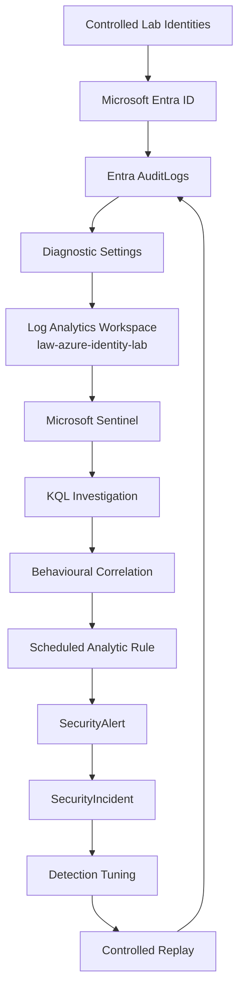

# Architecture: Azure Identity Detection & Correlation Lab

## Design Goal

This lab was designed to prove an end to end Azure identity detection workflow with the smallest practical cloud footprint.

The architecture had to support five things clearly: generation of identity activity, collection of Entra audit telemetry, investigation with KQL, conversion of a behavioural relationship into a Sentinel analytic rule, and fresh replay validation after deployment.

The final environment remained intentionally small because extra infrastructure would not have improved the identity evidence chain.

```text
Microsoft Entra ID
        ↓
AuditLogs
        ↓
Diagnostic Settings
        ↓
Log Analytics Workspace
        ↓
Microsoft Sentinel
        ↓
KQL Investigation
        ↓
Correlation Detection
        ↓
Scheduled Analytic Rule
        ↓
SecurityAlert
        ↓
SecurityIncident
        ↓
Tuning and Controlled Retest
```

## Final Logical Architecture



The important point is that Sentinel was not used only as a query interface. The project progressed from telemetry collection into investigation, rule deployment, alert generation, incident creation, tuning, and validation against fresh activity.

## Azure Resource Layout

| Component | Value | Purpose |
|---|---|---|
| Resource group | `rg-azure-identity-lab` | Logical boundary for the project resources |
| Log Analytics workspace | `law-azure-identity-lab` | Stores Entra audit telemetry and hosts Sentinel |
| Region | South Africa North | Azure deployment region for the workspace |
| Identity source | Microsoft Entra ID | Generates the identity management events used in the investigation |
| Primary table | `AuditLogs` | Source table for privilege and user management activity |
| SIEM | Microsoft Sentinel | Investigation, detection, alert, and incident layer |

Subscription IDs, tenant IDs, credentials, and private tenant details are intentionally excluded because they are not required to understand or reproduce the architecture.

## Identity Model

The investigation used controlled lab identities rather than real personal identities.

```text
lab-admin
    ↓
assigns User Administrator
    ↓
case-user
    ↓
creates another controlled identity
```

The primary investigation sequence used `case-secondary`. Live validation later used `case-validation` and `case-retest` so the deployed detection could be tested against activity generated after the rule already existed.

The project never treats these administrative actions as automatically malicious. Their security value comes from the behavioural relationship between privilege assignment, actor identity, sensitive follow on activity, and time.

## Telemetry Path

Microsoft Entra ID generated the source events. Diagnostic Settings forwarded `AuditLogs` into the dedicated Log Analytics workspace. Sentinel then queried the same data directly from the workspace.

The telemetry pipeline was proven before the main scenario was introduced.

```text
Controlled Entra action
        ↓
Native Entra audit record
        ↓
Diagnostic Settings forwarding
        ↓
Log Analytics ingestion
        ↓
Sentinel AuditLogs query
        ↓
Result = success
```

That early validation mattered because later correlation findings depended on knowing the data path was already working.

## Investigation Architecture

The investigation started broad rather than selecting only the two events that were already known.

KQL was used to reconstruct surrounding activity involving `case-user`, including password changes, security registration, user updates, role assignment, and user creation. The investigation then separated setup context from the security relevant sequence.

The final relationship was:

```text
User Administrator assigned to case-user
        ↓
36 minutes 11 seconds
        ↓
case-user creates case-secondary
```

That relationship became the detection hypothesis.

## Detection Architecture

The final analytic does not hardcode `case-user`, `case-secondary`, `case-validation`, or `case-retest`.

Instead, it searches for a successful `User Administrator` assignment and joins that event with a successful `Add user` action initiated by the same identity within a 60 minute correlation window.

The scheduled rule uses:

| Setting | Value |
|---|---|
| Rule name | `Newly Elevated User Administrator Creates Cloud Identity` |
| Severity | Medium |
| Frequency | 5 minutes |
| Lookback | 65 minutes |
| Correlation window | 60 minutes |
| Incident creation | Enabled |
| ATT&CK tactics | Persistence, Privilege Escalation |
| ATT&CK techniques | T1098, T1136 |

The elevated identity is mapped as an Account entity, while the assigned role, created user, and elapsed time are preserved as useful alert context.

## Deployment Architecture

The Sentinel Analytics page in the Defender portal redirected back to the workspace list during the build. Rather than stopping there, the analytic rule was deployed through Azure Cloud Shell using the Microsoft SecurityInsights REST API.

The deployment flow became:

```text
KQL detection file
        ↓
JSON rule definition
        ↓
Azure CLI authenticated session
        ↓
Microsoft SecurityInsights REST API
        ↓
Sentinel scheduled analytic rule
```

The deployment script resolves the active subscription from the authenticated Azure CLI session. It does not store a subscription ID, tenant ID, password, token, or client secret in the repository.

## Validation and Tuning Architecture

The first live replay proved that the deployed rule worked, but it also exposed a real engineering issue. The five minute schedule and 65 minute lookback allowed the same newly ingested `Add user` event to be matched during more than one overlapping rule execution.

The first replay therefore produced two alerts and two incidents.

The detection was then tuned so the role assignment remained available across the full context window while the sensitive `Add user` action became eligible in one ingestion slice only.

```kql
| where ingestion_time() >= ago(10m)
| where ingestion_time() < ago(5m)
```

A second fresh replay then produced:

```text
1 fresh replay
      ↓
1 SecurityAlert
      ↓
1 SecurityIncident
```

This final retest proved that the architecture supported not only detection creation, but also measurement, failure analysis, tuning, and repeat validation.

## Why No Local SIEM VM Was Needed

The project is intentionally Azure native.

A Kali, Ubuntu, or Windows VM would have made the diagram larger without improving the identity evidence chain. The required workflow was fully supported by Entra ID, Log Analytics, Sentinel, KQL, Azure Cloud Shell, and the Sentinel REST API.

The core local requirement was therefore only a browser based workstation.

A local endpoint would only become justified if a later version of the lab introduced endpoint telemetry, PowerShell activity, device identity signals, or Windows specific behaviour.

## Cost Discipline

The environment was kept deliberately small.

One resource group, one Log Analytics workspace, low volume Entra `AuditLogs`, and Sentinel were enough to complete the investigation and detection lifecycle. No Azure VM, high volume connector, unnecessary Logic App, or premium Defender deployment was added simply to make the project look larger.

The architecture follows a simple principle: add a component only when it improves the evidence, investigation, detection, or validation story.

## Public Repository Boundary

The public documentation excludes credentials and sensitive tenant information that provide no analytical value.

The repository does not publish passwords, MFA secrets, authenticator QR codes, client secrets, access keys, SAS tokens, bearer tokens, connection strings, private keys, real personal email addresses, subscription IDs, or tenant IDs.

Controlled lab identity names are retained where they are necessary to explain the investigation. Low risk operational identifiers may remain in evidence screenshots when they are part of the platform output and do not grant access or expose credentials.

The screenshots used in the final repository were reviewed before publication, and the deployment artifacts were written so that sensitive Azure identifiers are resolved at runtime rather than stored in source control.

## Final Architecture Result

The completed architecture supports the full evidence chain originally required by the project:

```text
IDENTITY ACTION
      ↓
RAW AUDIT TELEMETRY
      ↓
KQL INVESTIGATION
      ↓
EVENT CORRELATION
      ↓
SENTINEL ANALYTIC RULE
      ↓
SECURITY ALERT
      ↓
SECURITY INCIDENT
      ↓
TUNING
      ↓
FRESH RETEST
      ↓
VALIDATION
```

The architecture is therefore complete. Additional infrastructure would only be justified by a new telemetry source or a new investigation objective, not by the need to make the project appear more complex.