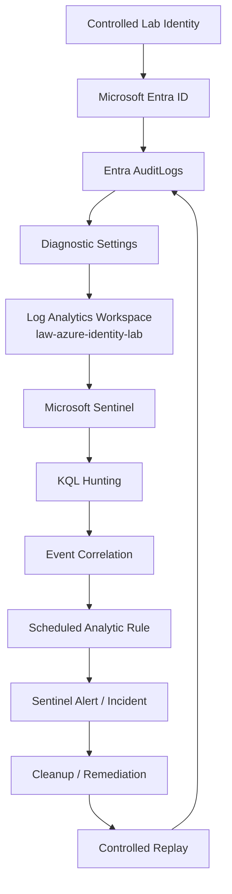

# Architecture — Azure Identity Detection & Correlation Lab

## Design Goal

Build the smallest Azure-native architecture capable of supporting a defensible identity investigation and a correlated Sentinel detection.

The design intentionally avoids unnecessary infrastructure.

```text
Microsoft Entra ID
        ↓
AuditLogs
        ↓
Diagnostic Settings
        ↓
Log Analytics Workspace
        ↓
Microsoft Sentinel
        ↓
KQL Investigation
        ↓
Correlation Detection
        ↓
Alert / Incident
        ↓
Cleanup / Replay / Validation
```

---

## Logical Architecture



---

## Resource Layout

### Azure subscription

A dedicated Azure lab subscription is used for this project.

Subscription and tenant identifiers are intentionally omitted from public documentation.

### Resource group

```text
rg-azure-identity-lab
```

Purpose:
- logical grouping for the project resources
- easier cleanup
- clear separation from unrelated Azure work

### Log Analytics workspace

```text
law-azure-identity-lab
```

Region:

```text
South Africa North
```

Purpose:
- receive Entra audit telemetry
- store/query logs
- act as the Sentinel workspace

### Microsoft Sentinel

Sentinel is enabled directly on the Log Analytics workspace.

Purpose:
- KQL investigation
- hunting
- analytic rule creation
- alert/incident validation

### Microsoft Entra ID

Current licence:

```text
Microsoft Entra ID Free
```

Primary telemetry source:

```text
AuditLogs
```

A dedicated controlled identity is used for lab activity:

```text
case-user
```

No real personal identity is required for the investigation narrative.

---

## Telemetry Path

### Source

Microsoft Entra ID generates identity-management audit records.

Examples observed during Phase 01:

```text
Add user
Update user
Add service principal
```

### Forwarding

Entra Diagnostic Settings forward selected audit telemetry to:

```text
law-azure-identity-lab
```

Only the required log category is enabled initially:

```text
AuditLogs
```

This keeps the architecture small and avoids collecting unnecessary data.

### Storage / Query Layer

The events are available in Log Analytics / Sentinel through the table:

```text
AuditLogs
```

### Investigation Layer

KQL is used to:

- retrieve identity events
- filter by category and operation
- reconstruct event sequences
- summarize baseline activity
- later correlate privilege changes with sensitive follow-on actions

---

## Phase 01 Validation

The architecture was not treated as complete until the telemetry path was proven end to end.

Validation sequence:

```text
Controlled user update
        ↓
Entra Audit Logs showed Update user
        ↓
Event forwarded into Log Analytics
        ↓
Sentinel AuditLogs returned UserManagement event
        ↓
KQL confirmed Result = success
```

Query used:

```kql
AuditLogs
| where Category == "UserManagement"
| project TimeGenerated, OperationName, Result, Category
| order by TimeGenerated desc
```

Observed result:

```text
OperationName: Update user
Result: success
Category: UserManagement
```

This proved the pipeline before the main scenario begins.

---

## Baseline Model

The baseline is deliberately small.

It is not described as an enterprise behavioural baseline.

It simply establishes which audit activity existed in the controlled tenant before the main privilege sequence is generated.

Query:

```kql
AuditLogs
| summarize Events=count() by Category, OperationName
| order by Events desc
```

Observed categories included:

```text
ApplicationManagement
Authentication
PolicyManagement
Authorization
UserManagement
```

This reference point becomes useful when Phase 02 introduces new privilege-related identity activity.

---

## Planned Investigation Path

The exact role/action pair remains subject to telemetry validation, but the investigation model is:

```text
Normal identity
      ↓
Administrative privilege assigned
      ↓
Same identity performs sensitive identity action
      ↓
AuditLogs preserve both events
      ↓
KQL reconstructs sequence
      ↓
Sentinel correlates sequence
      ↓
Cleanup
      ↓
Repeat same controlled sequence
      ↓
Validate detection
```

The core detection hypothesis is:

> **A newly elevated identity performs sensitive identity-management activity shortly afterward.**

This sequence is security-relevant, but the project will not equate it automatically with compromise or malicious intent.

---

## Why No Local SIEM VM?

The project is intentionally Azure-native.

Running Kali, Ubuntu, or Windows merely to make the topology larger would add complexity without improving the identity evidence chain.

Current local requirement:

```text
MacBook + browser
```

Possible later addition:

```text
PowerShell / Microsoft Graph replay script
```

A local Windows VM is only justified if later phases genuinely require endpoint telemetry or Windows-specific behaviour.

---

## Cost Discipline

The environment is designed to remain small:

- one resource group
- one Log Analytics workspace
- one Sentinel workspace
- low-volume Entra AuditLogs
- no Azure VM
- no premium Defender deployment
- no unnecessary Logic Apps
- no high-volume data connectors

Resources are added only if they directly improve the evidence or detection story.

---

## Security / Public Repository Boundary

The architecture documentation intentionally excludes:

```text
subscription IDs
tenant IDs
object IDs
correlation IDs
real UPNs
real tenant domain
billing information
credentials / secrets / tokens
```

These identifiers are not required to understand the architecture.

The final repository will be sanitized and secret-scanned before publication.

---

## Architecture Success Condition

The architecture is sufficient when it can support this full evidence chain:

```text
IDENTITY ACTION
      ↓
RAW AUDIT TELEMETRY
      ↓
KQL INVESTIGATION
      ↓
EVENT CORRELATION
      ↓
SENTINEL DETECTION
      ↓
REPLAY
      ↓
VALIDATION
```

If that chain is proven, additional infrastructure is unnecessary.
