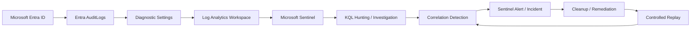

# Azure Identity Detection & Correlation Lab

> **Identity → Telemetry → Investigation → Correlation → Detection → Validation**

This project is a cloud identity investigation built with Microsoft Entra ID, Log Analytics, Microsoft Sentinel, and KQL. The goal is not to collect Azure screenshots. The goal is to prove that identity activity can be reconstructed from live telemetry, correlated into useful detection logic, and validated through controlled replay.

The central question is:

> **Can suspicious identity activity be reconstructed from Azure telemetry, correlated into a defensible detection, and validated by repeating the same controlled behaviour?**

This is not a generic Sentinel setup lab. Every phase is built around evidence, analyst reasoning, and what the telemetry can actually prove.

---

## Current Status

| Phase | Focus | Status |
|---|---|---|
| **01** | Architecture, telemetry pipeline & baseline | `Completed` |
| **02** | Controlled identity privilege sequence | `Next` |
| **03** | KQL investigation & timeline reconstruction | `Planned` |
| **04** | Sentinel detection engineering | `Planned` |
| **05** | Cleanup, exact replay & validation | `Planned` |

---

## 60 Second Project Summary

Phase 01 established the evidence pipeline before any suspicious activity was introduced. A controlled Entra identity was created, its activity was verified in native Entra audit telemetry, and the same class of `UserManagement` activity was then recovered inside Microsoft Sentinel through KQL.

The working path is:

```text
Microsoft Entra ID
        ↓
Entra AuditLogs
        ↓
Diagnostic Settings
        ↓
Log Analytics Workspace
        ↓
Microsoft Sentinel
        ↓
KQL Investigation
```

A controlled `Update user` event was successfully recovered from the Sentinel `AuditLogs` table with `Result: success` and `Category: UserManagement`. That confirmed the telemetry path was working end to end before the privilege related scenario begins.

A baseline query then summarized the audit activity already present across the tenant. The baseline is intentionally small. It is not presented as an enterprise behavioural model. Its purpose is to establish what activity existed before Phase 02 introduces the controlled identity sequence.

**Phase 01 establishes visibility only. No compromise or malicious identity activity is claimed.**

---

## Architecture

The environment stays deliberately lightweight and cloud native.



**Workspace:** `law-azure-identity-lab`  
**Resource group:** `rg-azure-identity-lab`  
**Region:** South Africa North

No local VM is required for the core telemetry path. Azure provides the identity, logging, SIEM, and query layers. Local scripting will only be introduced later if it improves repeatability during replay and validation.

[Open the full architecture notes](ARCHITECTURE.md)

---

# Phase 01: Architecture, Telemetry & Baseline

## Objective

Before generating the main identity scenario, Phase 01 had to prove three things: Entra records the controlled activity, the audit events reach the Log Analytics workspace behind Sentinel, and KQL can recover the resulting records.

## Environment

The lab currently uses Microsoft Entra ID Free, one controlled identity named `case-user`, one Azure resource group, one Log Analytics workspace, and Microsoft Sentinel. Only Entra `AuditLogs` are being forwarded at this stage.

No Azure VM, premium Defender plan, or unrelated cloud service was added simply to increase tool count.

## Source Telemetry Validation

The first evidence point came directly from Microsoft Entra ID. Creating the controlled identity produced an `Add user` event in the native audit log.


This proved that Entra was recording the identity management activity before Sentinel entered the evidence chain.

## Log Analytics Workspace

A dedicated Log Analytics workspace was deployed in the `rg-azure-identity-lab` resource group. This became the storage and query layer used by Microsoft Sentinel.


## Sentinel Enablement

Microsoft Sentinel was then enabled on the same workspace.


The important point is not the portal confirmation itself. It establishes where the later KQL investigation and analytic detection will operate.

## Audit Log Forwarding

Entra `AuditLogs` were configured to flow into `law-azure-identity-lab` through a diagnostic setting.


At this stage only `AuditLogs` were required. `SigninLogs` were deliberately left out because they were not necessary for the core Phase 01 validation and the project is being kept within the capabilities already available to the tenant.

## Sentinel KQL Validation

After the pipeline was active, a fresh controlled user update was generated and queried in Sentinel.

```kql
AuditLogs
| where Category == "UserManagement"
| project TimeGenerated, OperationName, Result, Category
| order by TimeGenerated desc
```

The query returned the controlled event as:

```text
OperationName: Update user
Result: success
Category: UserManagement
```


This is the strongest Phase 01 evidence because it proves the complete path:

```text
Controlled identity change
        ↓
Entra AuditLogs
        ↓
Log Analytics ingestion
        ↓
Sentinel AuditLogs table
        ↓
KQL result
```

## Baseline

Before Phase 02 begins, the available audit activity was summarized with:

```kql
AuditLogs
| summarize Events=count() by Category, OperationName
| order by Events desc
```

The baseline showed activity across `ApplicationManagement`, `Authentication`, `PolicyManagement`, `Authorization`, and `UserManagement`.

This baseline is not presented as statistically mature enterprise behaviour. It is a controlled reference point showing what was present before the privilege related sequence is introduced.

## Phase 01 Conclusion

The evidence proves that Entra generates identity management telemetry, that `AuditLogs` reach the Log Analytics workspace used by Sentinel, and that KQL can retrieve and summarize `UserManagement` events.

It does **not** prove unauthorized access, account compromise, malicious privilege escalation, or successful detection engineering. None of those events have occurred yet.

Phase 01 therefore closes with a known good telemetry path rather than an assumed one.

---

# Phase 02: Controlled Identity Sequence

**Status: Next**

The next phase will introduce one controlled privilege related sequence. The working detection hypothesis is:

> **A newly elevated identity performs sensitive identity management activity shortly afterward.**

The preferred flow is:

```text
normal identity
      ↓
new administrative privilege
      ↓
sensitive identity management action
      ↓
correlate the sequence
```

The exact privilege and follow on action will only be locked once their telemetry has been verified in this tenant. This remains a controlled security scenario and is not presented as compromise.

---

## Planned Detection Artifacts

```text
detections/
├── baseline-identity-activity.kql
├── identity-activity-hunt.kql
└── privilege-followed-by-sensitive-action.kql
```

A controlled replay script may also be added later:

```text
scripts/
└── controlled-identity-replay.ps1
```

The replay script will only be written after the exact Azure actions and resulting telemetry have been validated manually.

---

## Evidence Standard

Every conclusion in this project is separated into four layers:

```text
RAW EVIDENCE
      ↓
PLATFORM OBSERVATION
      ↓
ANALYST INFERENCE
      ↓
DEFENSIBLE CONCLUSION
```

The project will use language such as `the evidence supports`, `telemetry confirms`, `worth analyst review`, and `successful compromise was not established` where appropriate.

Administrative activity is never treated as malicious automatically.

---

## Public Repository Safety

The repository is being built privately first and will be sanitized before publication.

The public version will never contain passwords, client secrets, access keys, SAS tokens, connection strings, bearer tokens, private keys, or real credentials.

Tenant IDs, subscription IDs, correlation IDs, object IDs, real UPNs, tenant domains, and other identifiers will be redacted when they add no analytical value.

Every image is reviewed before publication, and the repository will receive a manual review and secret scan before it becomes public.

---

## Repository Structure

```text
.
├── README.md
├── ARCHITECTURE.md
├── images/
├── detections/
├── scripts/
└── docs/
```

Evidence and technical artifacts are being added as each phase closes so the final repository does not become a documentation backlog.

---

## Final Success Condition

The project is complete when the evidence can truthfully answer:

> **Can Azure identity telemetry prove that a newly elevated identity performed sensitive identity management activity, can KQL and Sentinel detect that sequence, and can the detection be validated by repeating the same controlled behaviour?**

If the evidence supports that answer, the project stops there. No extra Azure services will be added simply to make the architecture look bigger.
