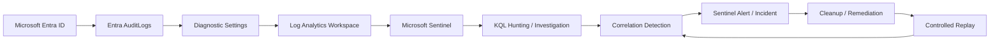

# Azure Identity Detection & Correlation Lab

> **Identity → Telemetry → Investigation → Correlation → Detection → Validation**

This project is a cloud identity investigation built with Microsoft Entra ID, Log Analytics, Microsoft Sentinel, and KQL. The goal is not to collect Azure screenshots. The goal is to prove that identity activity can be reconstructed from live telemetry, correlated into useful detection logic, and validated through controlled replay.

The central question is:

> **Can suspicious identity activity be reconstructed from Azure telemetry, correlated into a defensible detection, and validated by repeating the same controlled behaviour?**

This is not a generic Sentinel setup lab. Every phase is built around evidence, analyst reasoning, and what the telemetry can actually prove.

---

## Current Status

| Phase | Focus | Status |
|---|---|---|
| **01** | Architecture, telemetry pipeline & baseline | `Completed` |
| **02** | Controlled identity privilege sequence | `Completed` |
| **03** | KQL investigation & timeline reconstruction | `Next` |
| **04** | Sentinel detection engineering | `Planned` |
| **05** | Cleanup, exact replay & validation | `Planned` |

---

## 60 Second Project Summary

Phase 01 established the evidence pipeline before any security relevant activity was introduced. A controlled Entra identity was created, its activity was verified in native Entra audit telemetry, and the same class of `UserManagement` activity was then recovered inside Microsoft Sentinel through KQL.

Phase 02 then introduced the first controlled identity sequence. `case-user` received the built in `User Administrator` role and later used that privilege to create `case-secondary`. Both events reached Sentinel and were reconstructed into one chronological KQL view.

The current evidence chain is:

```text
case-user
        ↓
User Administrator assigned
        ↓
RoleManagement telemetry
        ↓
case-user creates case-secondary
        ↓
UserManagement telemetry
        ↓
KQL correlation timeline
```

This establishes the behaviour pattern that later phases will investigate and convert into detection logic.

**No compromise is claimed. Every action was controlled and intentionally generated inside the lab.**

---

## Architecture

The environment stays deliberately lightweight and cloud native.



**Workspace:** `law-azure-identity-lab`  
**Resource group:** `rg-azure-identity-lab`  
**Region:** South Africa North

No local VM is required for the core telemetry path. Azure provides the identity, logging, SIEM, and query layers. Local scripting will only be introduced later if it improves repeatability during replay and validation.

[Open the full architecture notes](ARCHITECTURE.md)

---

# Phase 01: Architecture, Telemetry & Baseline

## Objective

Before generating the main identity scenario, Phase 01 had to prove three things: Entra records the controlled activity, the audit events reach the Log Analytics workspace behind Sentinel, and KQL can recover the resulting records.

## Environment

The lab currently uses Microsoft Entra ID Free, one controlled identity named `case-user`, one Azure resource group, one Log Analytics workspace, and Microsoft Sentinel. Only Entra `AuditLogs` are being forwarded at this stage.

No Azure VM, premium Defender plan, or unrelated cloud service was added simply to increase tool count.

## Source Telemetry Validation

Creating the controlled identity produced an `Add user` event in the native Entra audit log.


This proved that Entra was recording identity management activity before Sentinel entered the evidence chain.

## Log Analytics Workspace

A dedicated Log Analytics workspace was deployed in the `rg-azure-identity-lab` resource group. This became the storage and query layer used by Microsoft Sentinel.


## Sentinel Enablement

Microsoft Sentinel was enabled on the same workspace.


## Audit Log Forwarding

Entra `AuditLogs` were configured to flow into `law-azure-identity-lab` through a diagnostic setting.


At this stage only `AuditLogs` were required. `SigninLogs` were deliberately left out because they were not necessary for the core validation and the project is being kept within the capabilities already available to the tenant.

## Sentinel KQL Validation

After the pipeline was active, a fresh controlled user update was generated and queried in Sentinel.

```kql
AuditLogs
| where Category == "UserManagement"
| project TimeGenerated, OperationName, Result, Category
| order by TimeGenerated desc
```

The query returned the controlled event as `Update user`, with `Result: success` and `Category: UserManagement`.


This confirmed the complete path from controlled identity change to Entra telemetry, Log Analytics ingestion, Sentinel, and KQL.

## Baseline

Before Phase 02 began, the available audit activity was summarized with:

```kql
AuditLogs
| summarize Events=count() by Category, OperationName
| order by Events desc
```

The baseline showed activity across `ApplicationManagement`, `Authentication`, `PolicyManagement`, `Authorization`, and `UserManagement`.

This baseline is not presented as statistically mature enterprise behaviour. It is a controlled reference point showing what was present before the privilege related sequence was introduced.

## Phase 01 Conclusion

The evidence proves that Entra generates identity management telemetry, that `AuditLogs` reach the Log Analytics workspace used by Sentinel, and that KQL can retrieve and summarize `UserManagement` events.

It does not prove unauthorized access, account compromise, malicious privilege escalation, or successful detection engineering.

Phase 01 therefore closes with a known good telemetry path rather than an assumed one.

---

# Phase 02: Controlled Identity Sequence

## Objective

Phase 02 introduced the first security relevant identity sequence. `case-user` started as a normal identity, received the built in `User Administrator` role, and then used that privilege to create a second identity named `case-secondary`.

The working hypothesis was:

> **A newly elevated identity performs sensitive identity management activity shortly afterward.**

This is a controlled detection scenario, not evidence of compromise.

## Privilege Assignment

Entra recorded the role change as a successful `RoleManagement` event. The modified properties identified the assigned role as `User Administrator`.


The same event was then recovered in Sentinel from the `AuditLogs` table.


This confirmed that the privilege change was present in both the native Entra audit view and the Sentinel investigation layer.

## Sensitive Identity Action

After receiving the role, `case-user` signed in separately and created `case-secondary`.

A KQL query extracted the actor and target while removing the tenant domain from the displayed values.

```kql
AuditLogs
| where OperationName == "Add user"
| extend ActorUPN = tostring(InitiatedBy.user.userPrincipalName)
| extend TargetUPN = tostring(TargetResources[0].userPrincipalName)
| extend Actor = tostring(split(ActorUPN, "@")[0])
| extend Target = tostring(split(TargetUPN, "@")[0])
| project TimeGenerated, Actor, OperationName, Target, Result, Category
| order by TimeGenerated desc
```

The result showed `case-user` as the actor, `Add user` as the operation, `case-secondary` as the target, and `success` as the result.


## Sequence Correlation

The final Phase 02 query brought the privilege assignment and the user creation into one chronological view.


The sequence reconstructed as:

```text
Privilege assigned
case-user
User Administrator
success

Sensitive identity action
case-user
Created case-secondary
success
```

This is the main result of Phase 02. It proves that the same identity received an administrative role and later performed a sensitive identity management action.

The full hunt query is preserved in:

[`detections/identity-activity-hunt.kql`](detections/identity-activity-hunt.kql)

[Read the full Phase 02 case notes](docs/phase-02-controlled-identity-sequence.md)

## Phase 02 Conclusion

The evidence proves that `case-user` received the `User Administrator` role, that the role assignment reached Sentinel, and that the same identity later created `case-secondary` successfully.

The evidence does not prove malicious intent, unauthorized privilege escalation, persistence, or account compromise. The value of the sequence is behavioural. In a real environment, this pattern would be worth analyst review because a newly elevated identity performed sensitive identity management activity shortly afterward.

Phase 02 therefore closes with a validated event chain ready for deeper investigation in Phase 03.

---

# Phase 03: KQL Investigation & Timeline Reconstruction

**Status: Next**

Phase 03 will investigate the Phase 02 sequence in more depth. The goal is to move beyond simply proving that two events occurred and instead determine which fields, relationships, time windows, and false positive considerations matter if this behaviour is going to become a reliable Sentinel detection.

---

## Planned Technical Artifacts

```text
detections/
├── baseline-identity-activity.kql
├── identity-activity-hunt.kql
└── privilege-followed-by-sensitive-action.kql

scripts/
└── controlled-identity-replay.ps1
```

The replay script will only be written after the exact Azure actions and resulting telemetry have been validated manually.

---

## Evidence Standard

Every conclusion in this project is separated into four layers:

```text
RAW EVIDENCE
      ↓
PLATFORM OBSERVATION
      ↓
ANALYST INFERENCE
      ↓
DEFENSIBLE CONCLUSION
```

Administrative activity is never treated as malicious automatically.

---

## Public Repository Safety

The repository is being built privately first and will be sanitized before publication.

The public version will never contain passwords, client secrets, access keys, SAS tokens, connection strings, bearer tokens, private keys, or real credentials.

Tenant IDs, subscription IDs, correlation IDs, object IDs, real UPNs, tenant domains, and other identifiers will be redacted when they add no analytical value.

Every image is reviewed before publication, and the repository will receive a manual review and secret scan before it becomes public.

---

## Repository Structure

```text
.
├── README.md
├── ARCHITECTURE.md
├── images/
├── detections/
├── scripts/
└── docs/
```

Evidence and technical artifacts are being added as each phase closes so the final repository does not become a documentation backlog.

---

## Final Success Condition

The project is complete when the evidence can truthfully answer:

> **Can Azure identity telemetry prove that a newly elevated identity performed sensitive identity management activity, can KQL and Sentinel detect that sequence, and can the detection be validated by repeating the same controlled behaviour?**

If the evidence supports that answer, the project stops there. No extra Azure services will be added simply to make the architecture look bigger.
