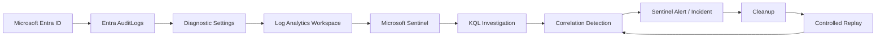

# Azure Identity Detection & Correlation Lab

> **Identity → Telemetry → Investigation → Correlation → Detection → Validation**

This project is a cloud identity investigation built with Microsoft Entra ID, Log Analytics, Microsoft Sentinel, and KQL. The goal is not to collect Azure screenshots. The goal is to prove that identity activity can be reconstructed from live telemetry, reduced into a defensible analyst finding, converted into detection logic, and later validated through controlled replay.

The central question is:

> **Can Azure identity telemetry prove that a newly elevated identity performed a sensitive identity action, and can that behaviour be turned into a useful Sentinel detection?**

Every phase is built around evidence. Administrative activity is never treated as malicious automatically, and the project only claims what the telemetry can support.

## Current Status

| Phase | Focus | Status |
|---|---|---|
| **01** | Architecture, telemetry pipeline and baseline | `Completed` |
| **02** | Controlled identity privilege sequence | `Completed` |
| **03** | KQL investigation and timeline reconstruction | `Completed` |
| **04** | Sentinel detection engineering | `Next` |
| **05** | Cleanup, exact replay and validation | `Planned` |

## 60 Second Project Summary

Phase 01 established a working evidence pipeline from Microsoft Entra ID into Log Analytics and Microsoft Sentinel. A controlled `UserManagement` event was generated in Entra and recovered successfully with KQL, proving that the investigation would be based on live tenant telemetry rather than assumed visibility.

Phase 02 introduced the controlled security sequence. `case-user` received the built in `User Administrator` role and later used that privilege to create `case-secondary`. Both events reached Sentinel and were recovered successfully.

Phase 03 investigated the surrounding activity rather than jumping directly to a conclusion. Password changes, security registration, and account setup events were retained as context while the two security relevant events were classified as the primary findings. The final reconstruction showed that `case-user` created `case-secondary` **36 minutes and 11 seconds after receiving User Administrator**.

The case currently reconstructs as:

```text
lab-admin
    ↓
assigns User Administrator
    ↓
case-user
    ↓
36 minutes 11 seconds
    ↓
creates case-secondary
    ↓
Microsoft Sentinel
    ↓
KQL investigation and correlation
```

No compromise is claimed. Every action was intentionally generated inside the lab.

## Architecture



**Workspace:** `law-azure-identity-lab`  
**Resource group:** `rg-azure-identity-lab`  
**Region:** South Africa North

The environment stays intentionally small. Azure provides the identity, logging, SIEM, and query layers. No local VM is required for the core evidence path.

[Open the full architecture notes](ARCHITECTURE.md)

# Phase 01: Architecture, Telemetry & Baseline

## Objective

Before generating any security relevant activity, the first phase had to prove that Entra recorded controlled identity changes, that those events reached the Log Analytics workspace behind Sentinel, and that KQL could recover them.

## Source Telemetry

Creating the controlled identity produced an `Add user` event in the native Entra audit log.


This proved that Entra was recording identity management activity before Sentinel entered the evidence chain.

## Log Analytics and Sentinel

A dedicated Log Analytics workspace was deployed inside `rg-azure-identity-lab` and Microsoft Sentinel was enabled on that workspace.


Entra `AuditLogs` were then forwarded into `law-azure-identity-lab` through Diagnostic Settings.


## KQL Validation

A fresh controlled user update was generated after the pipeline was active.

```kql
AuditLogs
| where Category == "UserManagement"
| project TimeGenerated, OperationName, Result, Category
| order by TimeGenerated desc
```

The result returned `Update user`, `success`, and `UserManagement` inside Microsoft Sentinel.


This established a known good path from controlled identity activity to Entra telemetry, Log Analytics ingestion, Sentinel, and KQL.

## Baseline

The initial audit activity was summarized with:

```kql
AuditLogs
| summarize Events=count() by Category, OperationName
| order by Events desc
```

The baseline contained `ApplicationManagement`, `Authentication`, `PolicyManagement`, `Authorization`, and `UserManagement` activity. This was not treated as an enterprise behavioural baseline. It simply established what existed before the privilege sequence was introduced.

## Phase 01 Conclusion

The evidence proved that identity management activity was being generated, forwarded, stored, and queried successfully. It did not prove compromise or malicious behaviour.

# Phase 02: Controlled Identity Sequence

## Objective

Phase 02 introduced the first security relevant sequence. `case-user` started as a normal identity, received `User Administrator`, and later created a second identity named `case-secondary`.

The working hypothesis was:

> **A newly elevated identity performs sensitive identity management activity shortly afterward.**

## Privilege Assignment

Entra recorded the role change as a successful `RoleManagement` event. The modified properties identified the new role as `User Administrator`.


The same role assignment was then recovered in Sentinel.


## Sensitive Identity Action

After elevation, `case-user` signed in separately and created `case-secondary`.

```kql
AuditLogs
| where OperationName == "Add user"
| extend ActorUPN = tostring(InitiatedBy.user.userPrincipalName)
| extend TargetUPN = tostring(TargetResources[0].userPrincipalName)
| extend Actor = tostring(split(ActorUPN, "@")[0])
| extend Target = tostring(split(TargetUPN, "@")[0])
| project TimeGenerated, Actor, OperationName, Target, Result, Category
| order by TimeGenerated desc
```

The result showed `case-user` as the actor, `case-secondary` as the target, and `success` as the result.


## Initial Correlation

The two events were then combined into one chronological view.


This proved that the same identity received an administrative role and later performed a sensitive identity management action.

[`detections/identity-activity-hunt.kql`](detections/identity-activity-hunt.kql)

[Read the full Phase 02 case notes](docs/phase-02-controlled-identity-sequence.md)

## Phase 02 Conclusion

The evidence proved the privilege assignment and the later user creation. It did not prove malicious intent, persistence, or unauthorized access. The value was in establishing a behaviour pattern that could be investigated more deeply.

# Phase 03: KQL Investigation & Timeline Reconstruction

## Objective

Phase 03 treated the Phase 02 sequence as an analyst investigation. Instead of selecting only the two known events, the hunt widened around `case-user` to determine what other activity occurred before and after elevation.

The broader search surfaced password resets, password profile changes, security registration, user updates, password validation, the role assignment, and the later creation of `case-secondary`.

That surrounding activity mattered because it showed why correlation requires context. Events that occur near a suspicious sequence are not automatically suspicious themselves.

## Triage and Context

The investigation classified events into `Primary finding`, `Setup context`, and `Other context`. The two primary findings were the privilege assignment and the later user creation. Password and security registration events were retained as setup context rather than removed from the investigation.


This view preserves the surrounding evidence while preventing normal setup activity from being mistaken for part of the security finding.

[`detections/phase3_identity_activity_triage.kql`](detections/phase3_identity_activity_triage.kql)

## Timeline Reconstruction

The final query isolated the privilege assignment and the follow on identity action, ordered them chronologically, and calculated the time between them.


The reconstructed sequence was:

```text
04:32:54 UTC
case-user received User Administrator

05:09:05 UTC
case-user created case-secondary

Elapsed time
00:36:11
```

[`detections/phase3_timeline_reconstruction.kql`](detections/phase3_timeline_reconstruction.kql)

[Read the full Phase 03 investigation](docs/phase-03-kql-investigation-and-timeline.md)

## Analyst Finding

**PROVEN:** `case-user` received the built in `User Administrator` role successfully. The same identity later created `case-secondary` successfully. The elapsed time between those events was approximately 36 minutes and 11 seconds.

**SUPPORTED:** The sequence is security relevant because a newly elevated identity performed a sensitive identity management action soon after receiving additional privilege. In a real environment this behaviour would justify analyst review and is suitable for correlation based detection logic.

**NOT PROVEN:** The evidence does not prove compromise, malicious intent, credential theft, attacker control, or unauthorized persistence. The activity was intentionally generated as part of the lab.

## Detection Engineering Implication

The investigation changed the question from:

> **Did a role assignment happen?**

into:

> **Did an identity receive a selected administrative role and then perform a sensitive identity action within a meaningful time window?**

That distinction is the main result of Phase 03. A role assignment by itself is an administrative event. A user creation by itself is also an administrative event. The value comes from correlating the two around the same identity and time window while retaining enough context for analyst validation.

# Phase 04: Sentinel Detection Engineering

**Status: Next**

Phase 04 will convert the Phase 03 investigation logic into a Microsoft Sentinel analytic rule. The goal is one strong correlation detection, not a collection of noisy single event alerts.

The rule will focus on the behaviour already proven by the evidence:

```text
selected administrative privilege assigned
        ↓
same identity
        ↓
sensitive identity management action
        ↓
within defined time window
```

If the first rule works as designed, that result will be documented honestly. A detection miss will not be manufactured simply to create a tuning story.

# Phase 05: Cleanup, Replay & Validation

Phase 05 will return the lab to a known state, repeat the same controlled behaviour, and test whether the Phase 04 analytic rule generates the expected Sentinel alert or incident.

The final project succeeds only if the same behaviour can be reproduced and detected without changing the underlying story.

## Technical Artifacts

```text
detections/
├── identity-activity-hunt.kql
├── phase3_identity_activity_triage.kql
├── phase3_timeline_reconstruction.kql
└── privilege-followed-by-sensitive-action.kql   # Phase 04

scripts/
└── controlled-identity-replay.ps1               # Planned for validation
```

## Evidence Standard

Every conclusion in this project follows the same path:

```text
RAW EVIDENCE
      ↓
PLATFORM OBSERVATION
      ↓
ANALYST INFERENCE
      ↓
DEFENSIBLE CONCLUSION
```

The project does not automatically equate administrative activity with malicious activity.

## Public Repository Safety

The repository is being built privately first and will be sanitized before publication. Passwords, client secrets, access keys, SAS tokens, connection strings, bearer tokens, private keys, and real credentials are never published.

Identifiers and account details are removed when they provide no analytical value. Screenshots are reviewed before publication, and the final repository will receive a manual review and secret scan before becoming public.

## Repository Structure

```text
.
├── README.md
├── ARCHITECTURE.md
├── images/
├── detections/
├── scripts/
└── docs/
```

Evidence and technical artifacts are added as each phase closes so the project never becomes a documentation backlog.

## Final Success Condition

The project is complete when the evidence can truthfully answer:

> **Can Azure identity telemetry prove that a newly elevated identity performed sensitive identity management activity, can KQL and Sentinel detect that sequence, and can the detection be validated by repeating the same controlled behaviour?**

If the evidence supports that answer, the project stops there. No extra Azure services will be added simply to make the architecture look bigger.
