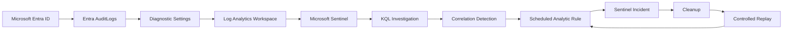

# Azure Identity Detection & Correlation Lab

> **Identity → Telemetry → Investigation → Correlation → Detection → Validation**

This project is a cloud identity investigation built with Microsoft Entra ID, Log Analytics, Microsoft Sentinel, KQL, Azure Cloud Shell, and the Sentinel REST API. The goal is not to collect Azure screenshots. The goal is to prove that identity activity can be reconstructed from live telemetry, reduced into a defensible analyst finding, converted into a reusable detection, and then validated through controlled replay.

The central question is:

> **Can Azure identity telemetry prove that a newly elevated identity performed a sensitive identity action, and can that behaviour be turned into a Sentinel detection that survives a fresh replay?**

Every phase is built around evidence. Administrative activity is never treated as malicious automatically, and the project only claims what the telemetry supports.

## Current Status

| Phase | Focus | Status |
|---|---|---|
| **01** | Architecture, telemetry pipeline and baseline | `Completed` |
| **02** | Controlled identity privilege sequence | `Completed` |
| **03** | KQL investigation and timeline reconstruction | `Completed` |
| **04** | Sentinel detection engineering | `Completed` |
| **05** | Controlled replay, alert validation and cleanup | `Next` |

## 60 Second Project Summary

Phase 01 established a working evidence path from Microsoft Entra ID into Log Analytics and Microsoft Sentinel. Phase 02 introduced a controlled sequence where `case-user` received the built in `User Administrator` role and later created `case-secondary`.

Phase 03 widened the investigation around that identity instead of jumping directly to the two known events. Password changes, security registration, user updates, and validation activity were retained as context. The final reconstruction showed that `case-user` created `case-secondary` **36 minutes and 11 seconds after receiving User Administrator**.

Phase 04 converted that behaviour into a generic Sentinel correlation rule. The detection contains no hardcoded reference to `case-user` or `case-secondary`. It looks for a successful `User Administrator` assignment followed by the same identity creating another Entra user within 60 minutes. The rule was then deployed through the Microsoft SecurityInsights API and read back from Sentinel to verify that it exists, is enabled, and is configured to create incidents.

The case currently looks like this:

```text
lab-admin
    ↓
assigns User Administrator
    ↓
case-user
    ↓
36 minutes 11 seconds
    ↓
creates case-secondary
    ↓
Sentinel KQL investigation
    ↓
generic correlation detection
    ↓
Scheduled analytic rule deployed as code
```

No compromise is claimed. Every action was intentionally generated inside the lab.

## Architecture



**Workspace:** `law-azure-identity-lab`  
**Resource group:** `rg-azure-identity-lab`  
**Region:** South Africa North

The environment stays intentionally small. Azure provides the identity, logging, SIEM, query, and rule deployment layers. No local VM is required for the core evidence path.

[Open the full architecture notes](ARCHITECTURE.md)

# Phase 01: Architecture, Telemetry & Baseline

Phase 01 proved that Entra identity activity was being generated, forwarded, stored, and queried successfully.

Creating the controlled identity produced an `Add user` event in the native Entra audit log.


A dedicated Log Analytics workspace was deployed and Microsoft Sentinel was enabled on it.


Entra `AuditLogs` were then forwarded into the workspace through Diagnostic Settings.


A fresh user update was recovered in Sentinel with KQL.


The phase closed with a known good telemetry path and no claim of compromise.

# Phase 02: Controlled Identity Sequence

Phase 02 introduced the behaviour the project would eventually detect. `case-user` received the built in `User Administrator` role and later created `case-secondary`.


The role assignment was recovered in Sentinel.


After elevation, `case-user` created `case-secondary` and the actor, action, target, and result were extracted with KQL.


The two events were then brought into one chronological view.


[`detections/identity-activity-hunt.kql`](detections/identity-activity-hunt.kql)

[Read the full Phase 02 case notes](docs/phase-02-controlled-identity-sequence.md)

# Phase 03: KQL Investigation & Timeline Reconstruction

Phase 03 treated the sequence as an analyst investigation. The broader hunt preserved password changes, account setup, security registration, and validation activity instead of hiding it.

The investigation classified the two security relevant events as `Primary finding` and retained the remaining activity as context.


[`detections/phase3_identity_activity_triage.kql`](detections/phase3_identity_activity_triage.kql)

The final reconstruction calculated the exact elapsed time between privilege assignment and user creation.


```text
04:32:54 UTC
case-user received User Administrator

05:09:05 UTC
case-user created case-secondary

Elapsed time
00:36:11
```

[`detections/phase3_timeline_reconstruction.kql`](detections/phase3_timeline_reconstruction.kql)

[Read the full Phase 03 investigation](docs/phase-03-kql-investigation-and-timeline.md)

The evidence proves the sequence and timing. It supports correlation based detection logic. It does not prove compromise, credential theft, attacker control, or malicious intent.

# Phase 04: Sentinel Detection Engineering

Phase 04 converted the investigation into a reusable detection rather than a query that already knew the lab answer.

## Historical Detection Validation

The candidate query contains no `case-user` or `case-secondary` filter. It joins successful `Add member to role` events with successful `Add user` events on the same identity and requires the second event to happen within 60 minutes of elevation.

The historical telemetry produced one expected match:

```text
Identity: case-user
Role: User Administrator
CreatedUser: case-secondary
TimeToAction: 00:36:11
```


[`detections/privilege-followed-by-user-creation.kql`](detections/privilege-followed-by-user-creation.kql)

## Scheduled Sentinel Rule

The rule is named:

`Newly Elevated User Administrator Creates Cloud Identity`

It runs every five minutes with a 65 minute lookback. The correlation window is 60 minutes. The extra five minutes supports the scheduled execution interval while the `Add user` side is constrained by ingestion time to avoid repeatedly alerting on the same historical action.

The rule uses Medium severity, maps to Persistence and Privilege Escalation, maps the elevated identity as an Account entity, and carries the assigned role, created user, and time to action as custom details.

Incident creation is enabled.

## Deployment as Code

The Defender portal Analytics page redirected back to the workspace list, so the rule was deployed through Azure Cloud Shell with the Microsoft SecurityInsights REST API.


The deployment script is preserved here:

[`scripts/deploy-sentinel-rule.sh`](scripts/deploy-sentinel-rule.sh)

The script contains no subscription ID, tenant ID, password, token, or secret. It resolves the active subscription from the authenticated Azure CLI session.

## Configuration Verification

The rule was then read back through the API to verify the final stored configuration rather than relying only on the creation response.


Sentinel confirmed:

```text
Enabled: true
CreateIncident: true
Frequency: PT5M
Lookback: PT1H5M
Severity: Medium
Tactics: Persistence, PrivilegeEscalation
Techniques: T1098, T1136
```

[Read the full Phase 04 engineering notes](docs/phase-04-sentinel-detection-engineering.md)

## Phase 04 Conclusion

The historical sequence is detected by generic correlation logic. The scheduled rule is deployed, enabled, and configured to create incidents.

What is **not yet proven** is whether the deployed rule will fire against a brand new sequence generated after the detection already exists. That is the purpose of Phase 05.

# Phase 05: Controlled Replay, Alert Validation & Cleanup

Phase 05 will repeat the same behaviour using a fresh target identity and test whether the live scheduled rule creates the expected Sentinel alert or incident.

The validation sequence will be:

```text
assign User Administrator to case-user
        ↓
sign in as case-user
        ↓
create case-validation
        ↓
wait for Sentinel ingestion and scheduled rule execution
        ↓
verify alert or incident
        ↓
remove temporary privilege and clean up validation identity
```

The project succeeds only if the rule detects the fresh replay without changing the detection to fit the new data.

## Technical Artifacts

```text
detections/
├── identity-activity-hunt.kql
├── phase3_identity_activity_triage.kql
├── phase3_timeline_reconstruction.kql
└── privilege-followed-by-user-creation.kql

scripts/
└── deploy-sentinel-rule.sh
```

## Evidence Standard

Every conclusion follows the same path:

```text
RAW EVIDENCE
      ↓
PLATFORM OBSERVATION
      ↓
ANALYST INFERENCE
      ↓
DEFENSIBLE CONCLUSION
```

The project does not automatically equate administrative activity with malicious activity.

## Public Repository Safety

The repository is being built privately first and will be sanitized before publication. Passwords, client secrets, access keys, SAS tokens, connection strings, bearer tokens, private keys, and real credentials are never published.

Identifiers and account details are removed when they provide no analytical value. Screenshots are reviewed before publication, and the final repository will receive a manual review and secret scan before becoming public.

## Final Success Condition

The project is complete when the evidence can truthfully answer:

> **Can Azure identity telemetry prove that a newly elevated identity performed sensitive identity management activity, can Sentinel detect that sequence with reusable correlation logic, and can the same detection survive a fresh controlled replay?**
