# Azure Identity Detection & Correlation Lab

> **Identity → Telemetry → Investigation → Correlation → Detection → Validation**

This project is a cloud identity investigation built with Microsoft Entra ID, Log Analytics, Microsoft Sentinel, KQL, Azure Cloud Shell, and the Sentinel REST API.

The goal was not to collect Azure screenshots. The goal was to prove that identity activity could be reconstructed from live telemetry, reduced into a defensible analyst finding, converted into reusable detection logic, deployed as a real Sentinel analytic rule, and validated through fresh controlled replay.

The central question was:

> **Can Azure identity telemetry prove that a newly elevated identity performed a sensitive identity action, can Sentinel detect that behaviour with reusable correlation logic, and can the detection survive a fresh replay?**

The final answer is **yes**.

## Current Status

| Phase | Focus | Status |
|---|---|---|
| **01** | Architecture, telemetry pipeline and baseline | `Completed` |
| **02** | Controlled identity privilege sequence | `Completed` |
| **03** | KQL investigation and timeline reconstruction | `Completed` |
| **04** | Sentinel detection engineering | `Completed` |
| **05** | Controlled replay, tuning and final validation | `Completed` |

## 60 Second Project Summary

Phase 01 established a working evidence path from Microsoft Entra ID into Log Analytics and Microsoft Sentinel.

Phase 02 introduced the controlled behaviour. `case-user` received the built in `User Administrator` role and later created `case-secondary`.

Phase 03 widened the investigation around that identity. Password changes, security registration, user updates, and validation activity were retained as context instead of being hidden. The final reconstruction showed that `case-user` created `case-secondary` **36 minutes and 11 seconds after receiving User Administrator**.

Phase 04 converted that behaviour into a generic Sentinel correlation rule. The detection contains no hardcoded reference to `case-user` or `case-secondary`. It looks for a successful `User Administrator` assignment followed by the same identity creating another Entra user within 60 minutes. The rule was deployed through the Microsoft SecurityInsights REST API and read back from Sentinel to verify the stored configuration.

Phase 05 replayed the behaviour after the rule already existed. The first live replay generated duplicate alerts and duplicate incidents because overlapping scheduled evaluation windows matched the same newly ingested action more than once. Instead of hiding that result, the detection was tuned. A second fresh replay then produced exactly **one Sentinel alert and one Sentinel incident**.

The final engineering path was:

```text
Entra identity activity
        ↓
AuditLogs
        ↓
KQL investigation
        ↓
behavioural correlation
        ↓
Scheduled Sentinel analytic rule
        ↓
first live replay
        ↓
duplicate alert discovery
        ↓
query tuning
        ↓
second fresh replay
        ↓
1 alert → 1 incident
```

No compromise is claimed. Every action was intentionally generated inside the lab.

## Architecture

```mermaid
flowchart LR
    A["Microsoft Entra ID"] --> B["Entra AuditLogs"]
    B --> C["Diagnostic Settings"]
    C --> D["Log Analytics Workspace"]
    D --> E["Microsoft Sentinel"]
    E --> F["KQL Investigation"]
    F --> G["Correlation Detection"]
    G --> H["Scheduled Analytic Rule"]
    H --> I["SecurityAlert"]
    I --> J["SecurityIncident"]
    J --> K["Tuning"]
    K --> L["Controlled Retest"]
    L --> H
```

**Workspace:** `law-azure-identity-lab`  
**Resource group:** `rg-azure-identity-lab`  
**Region:** South Africa North

The environment stays intentionally small. Azure provides the identity, logging, SIEM, query, and deployment layers. No local VM is required for the core evidence path.

[Open the full architecture notes](ARCHITECTURE.md)

# Phase 01: Architecture, Telemetry & Baseline

Phase 01 proved that Entra identity activity was being generated, forwarded, stored, and queried successfully.

Creating the controlled identity produced an `Add user` event in the native Entra audit log.

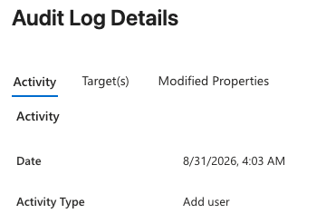

A dedicated Log Analytics workspace was deployed and Microsoft Sentinel was enabled on it.

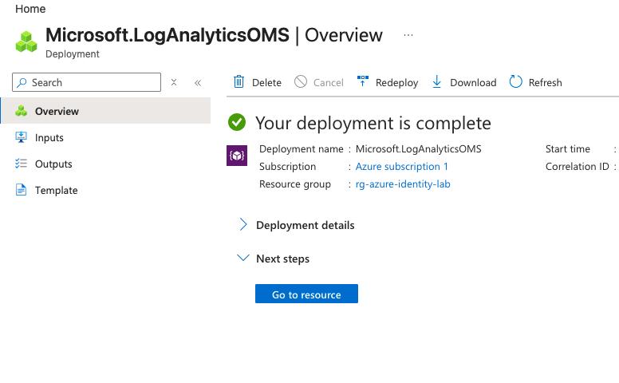

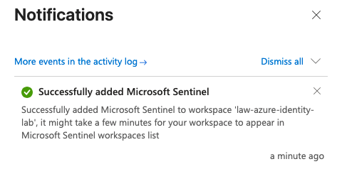

Entra `AuditLogs` were forwarded into the workspace through Diagnostic Settings.

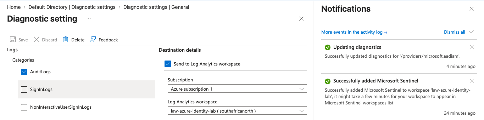

A fresh user update was then recovered inside Sentinel with KQL.

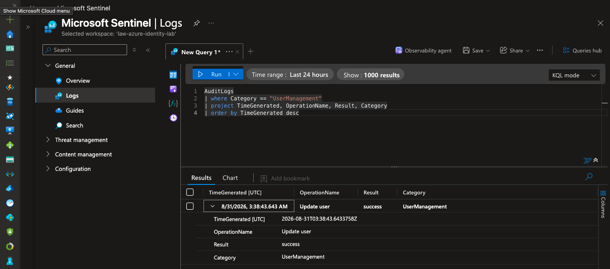

Phase 01 closed with a known good telemetry path and no claim of compromise.

# Phase 02: Controlled Identity Sequence

Phase 02 introduced the behaviour the project would eventually detect. `case-user` received the built in `User Administrator` role and later created `case-secondary`.

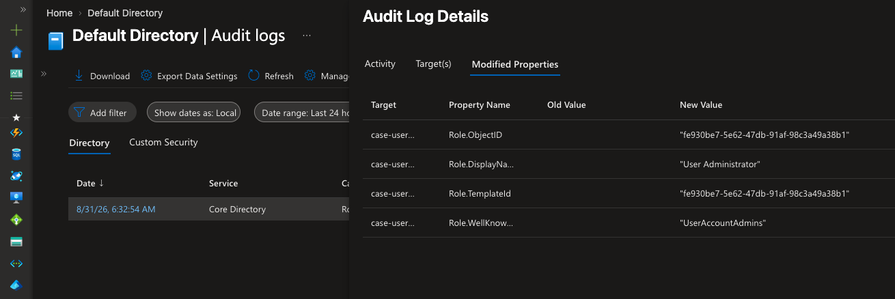

The role assignment was recovered in Sentinel.

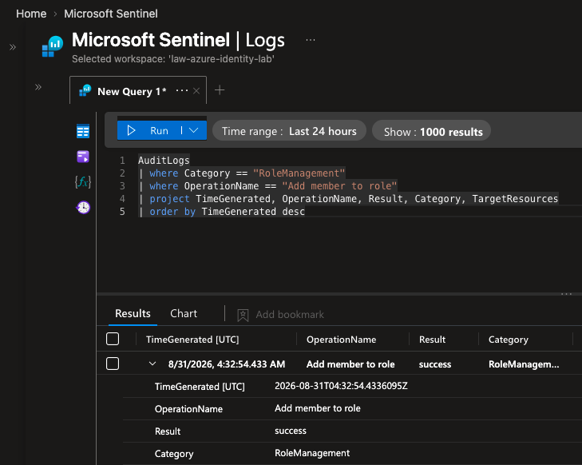

After elevation, `case-user` created `case-secondary` and the actor, action, target, and result were extracted with KQL.

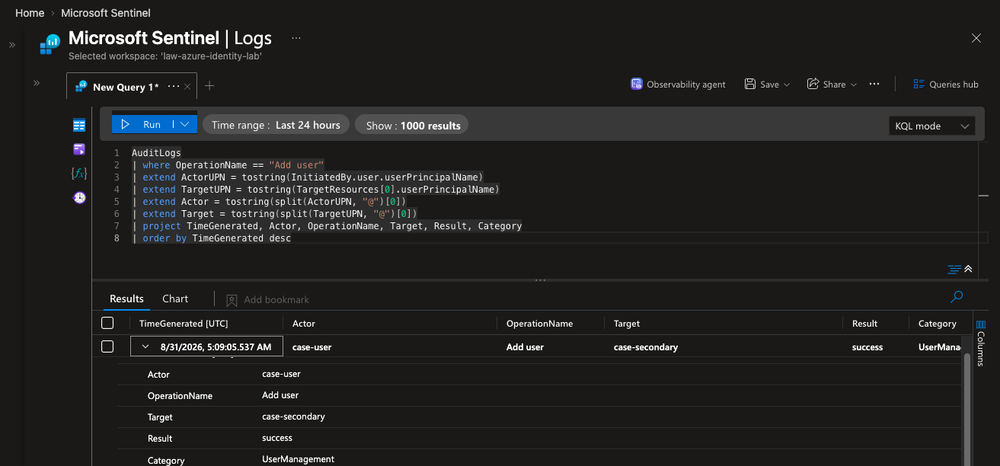

The two events were then brought into one chronological view.

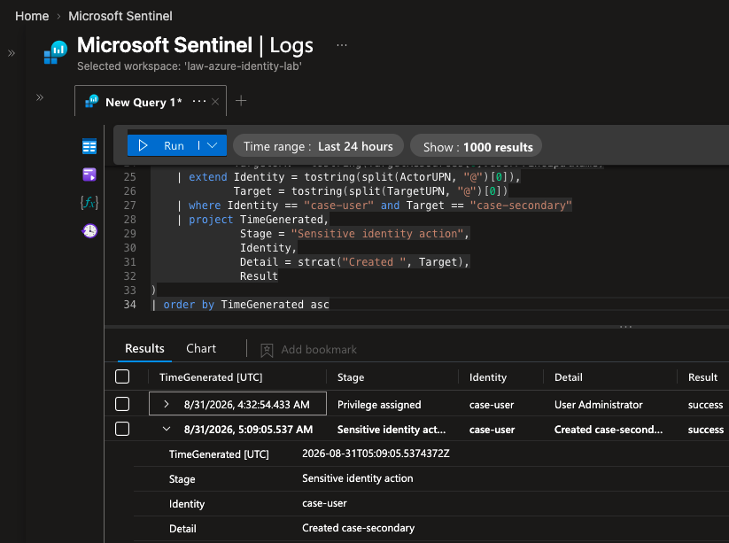

[`detections/identity-activity-hunt.kql`](detections/identity-activity-hunt.kql)

[Read the full Phase 02 case notes](docs/phase-02-controlled-identity-sequence.md)

# Phase 03: KQL Investigation & Timeline Reconstruction

Phase 03 treated the sequence as an analyst investigation rather than selecting only the two known events.

The broader hunt retained password changes, account setup, security registration, and validation activity as context. The two security relevant events were classified as `Primary finding`.

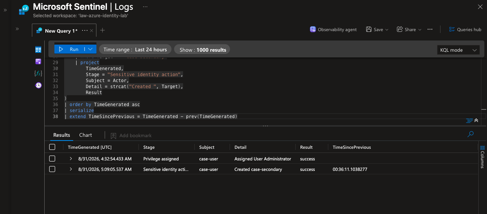

[`detections/phase3_identity_activity_triage.kql`](detections/phase3_identity_activity_triage.kql)

The final reconstruction calculated the exact elapsed time between privilege assignment and user creation.


```text
04:32:54 UTC
case-user received User Administrator

05:09:05 UTC
case-user created case-secondary

Elapsed time
00:36:11
```

[`detections/phase3_timeline_reconstruction.kql`](detections/phase3_timeline_reconstruction.kql)

[Read the full Phase 03 investigation](docs/phase-03-kql-investigation-and-timeline.md)

The evidence proves the sequence and timing. It supports correlation based detection logic. It does not prove compromise, credential theft, attacker control, or malicious intent.

# Phase 04: Sentinel Detection Engineering

Phase 04 converted the investigation into a reusable detection rather than a query that already knew the lab answer.

## Historical Detection Validation

The candidate query contains no `case-user` or `case-secondary` filter. It joins successful `Add member to role` events with successful `Add user` events on the same identity and requires the second event to happen within 60 minutes of elevation.

The historical telemetry produced the expected match:

```text
Identity: case-user
Role: User Administrator
CreatedUser: case-secondary
TimeToAction: 00:36:11
```

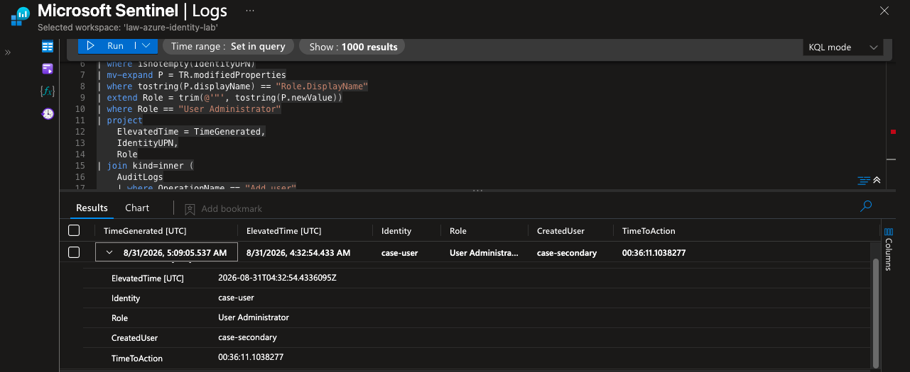

[`detections/privilege-followed-by-user-creation.kql`](detections/privilege-followed-by-user-creation.kql)

## Scheduled Sentinel Rule

The deployed rule is named:

`Newly Elevated User Administrator Creates Cloud Identity`

It runs every five minutes with a 65 minute lookback and a 60 minute correlation window. It uses Medium severity, maps the elevated identity as an Account entity, includes the assigned role, created user, and time to action as custom details, and is configured to create incidents.

## Deployment as Code

The Defender portal Analytics page redirected back to the workspace list, so the rule was deployed through Azure Cloud Shell using the Microsoft SecurityInsights REST API.

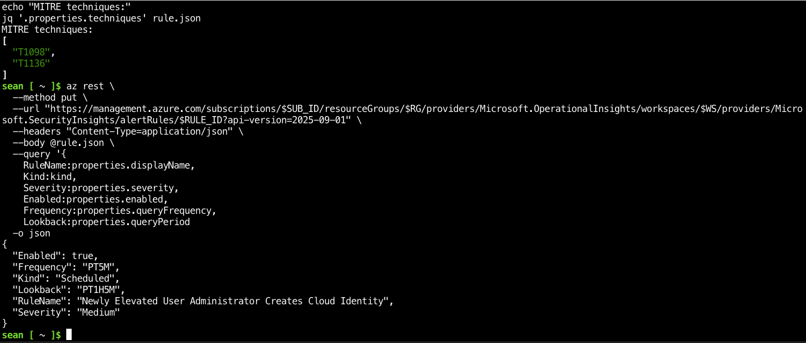

[`scripts/deploy-sentinel-rule.sh`](scripts/deploy-sentinel-rule.sh)

The script contains no subscription ID, tenant ID, password, token, or secret. It resolves the active subscription from the authenticated Azure CLI session.

## Configuration Verification

The rule was read back through the API to verify the stored configuration instead of relying only on the creation response.

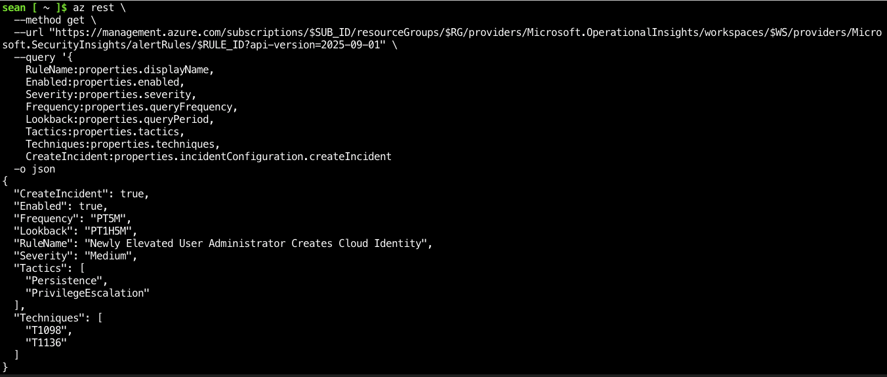

Sentinel confirmed:

```text
Enabled: true
CreateIncident: true
Frequency: PT5M
Lookback: PT1H5M
Severity: Medium
Tactics: Persistence, PrivilegeEscalation
Techniques: T1098, T1136
```

[Read the full Phase 04 engineering notes](docs/phase-04-sentinel-detection-engineering.md)

# Phase 05: Controlled Replay, Tuning & Final Validation

Phase 05 tested the rule against brand new activity generated after deployment.

## First Live Replay

`case-user` was elevated again and created `case-validation`.

Sentinel recovered the replay successfully.

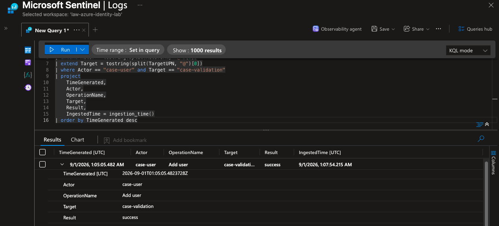

The rule fired, but the first live test produced **two SecurityAlert records** for the same replay.

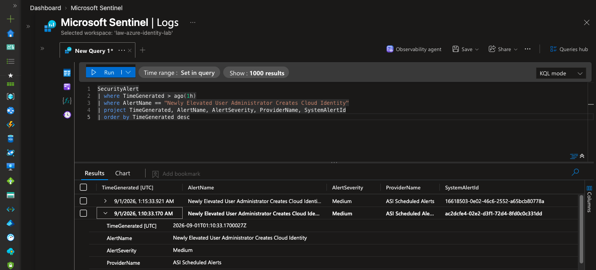

Two corresponding Sentinel incidents were also created.

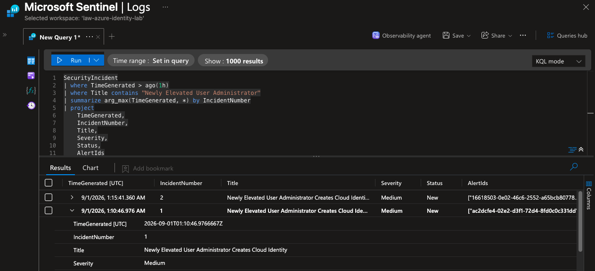

This was a real tuning issue. The scheduled rule ran every five minutes while looking back across 65 minutes, so the same newly ingested sensitive action was eligible in more than one overlapping execution.

## Detection Tuning

The detection was updated so the role assignment can still be searched across the full context window while the `Add user` action is eligible inside one ingestion slice:

```kql
| where ingestion_time() >= ago(10m)
| where ingestion_time() < ago(5m)
```

The existing Sentinel analytic rule was updated using the same rule identifier.

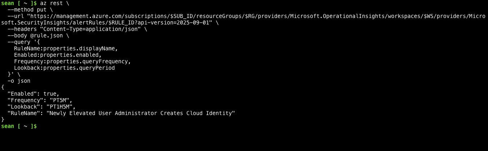

The final tuned query is preserved in:

[`detections/privilege-followed-by-user-creation.kql`](detections/privilege-followed-by-user-creation.kql)

## Final Retest

A second fresh sequence was generated using a new target named `case-retest`.

Sentinel recovered the new action successfully.

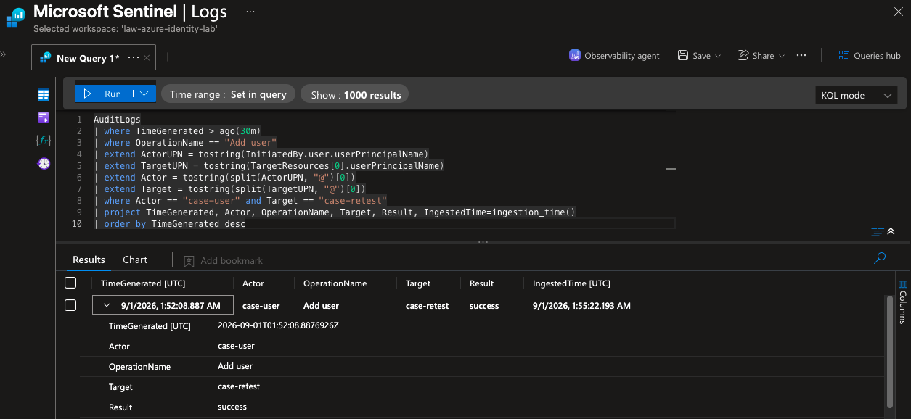

The tuned rule produced exactly **one new SecurityAlert**.

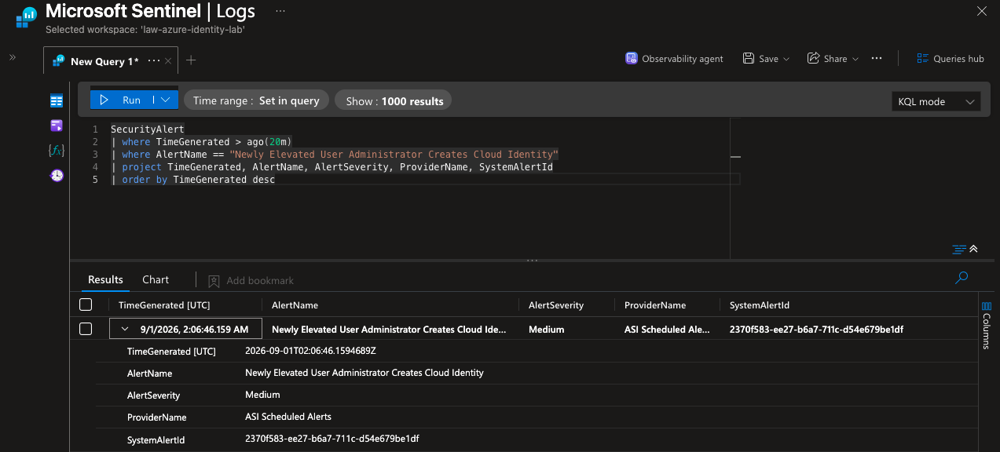

The corresponding `SecurityIncident` query returned exactly **one new incident**, Incident 3, with Medium severity and New status.

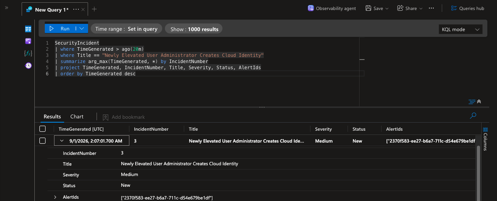

The final validation result was:

```text
1 fresh replay
      ↓
1 Sentinel alert
      ↓
1 Sentinel incident
```

[Read the full Phase 05 validation notes](docs/phase-05-controlled-replay-and-validation.md)

## Final Analyst Finding

**PROVEN:** The same identity received `User Administrator` and later performed a sensitive identity management action. The generic correlation logic detected the historical sequence. The deployed Sentinel rule detected fresh replay activity. The first live replay exposed duplicate alerting. After tuning, a second fresh replay generated one alert and one incident.

**SUPPORTED:** The final analytic is a useful behavioural detection for the lab because it correlates privilege assignment and sensitive follow on activity around the same actor and a defined time window.

**NOT PROVEN:** The rule does not prove compromise, attacker control, malicious intent, credential theft, or unauthorized persistence. Similar administrative activity can occur legitimately, so analyst validation remains necessary.

# Technical Artifacts

```text
detections/
├── identity-activity-hunt.kql
├── phase3_identity_activity_triage.kql
├── phase3_timeline_reconstruction.kql
└── privilege-followed-by-user-creation.kql

scripts/
└── deploy-sentinel-rule.sh

docs/
├── phase-02-controlled-identity-sequence.md
├── phase-03-kql-investigation-and-timeline.md
├── phase-04-sentinel-detection-engineering.md
└── phase-05-controlled-replay-and-validation.md
```

# Evidence Standard

Every conclusion follows the same path:

```text
RAW EVIDENCE
      ↓
PLATFORM OBSERVATION
      ↓
ANALYST INFERENCE
      ↓
DEFENSIBLE CONCLUSION
```

Administrative activity is never treated as malicious automatically.

# Public Repository Safety

The repository was built privately first so screenshots and artifacts could be reviewed before publication.

Passwords, client secrets, access keys, SAS tokens, connection strings, bearer tokens, private keys, and real credentials are never published.

Identifiers and account details are removed when they provide no analytical value. Lab identities are used throughout the investigation, and displayed KQL results are sanitized where appropriate.

# Final Result

The project answered its original question.

Azure identity telemetry was sufficient to reconstruct a privilege assignment followed by sensitive identity activity. KQL converted the raw events into a defensible behavioural relationship. That relationship became a generic Sentinel analytic rule. The rule was deployed as code, tested against fresh activity, failed cleanly in one important way, was tuned, and then passed a second live validation with **one alert and one incident**.

The lab therefore closes with a detection that was not only written, but investigated, deployed, broken, tuned, and proven against fresh telemetry.
