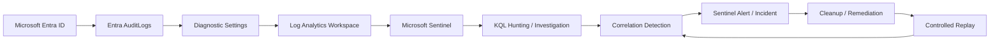

# Azure Identity Detection & Correlation Lab

> **Identity → Telemetry → Investigation → Correlation → Detection → Validation**

A cloud identity security project built around Microsoft Entra ID, Log Analytics, Microsoft Sentinel, and KQL.

The lab is designed around one central question:

> **Can suspicious identity activity be reconstructed from Azure telemetry, correlated into a defensible detection, and validated by repeating the same controlled behaviour?**

This is not a generic Sentinel setup lab. The emphasis is on what the telemetry actually proves, how identity events relate to each other, and whether detection logic can convert raw visibility into an analyst-useful signal.

---

## Current Status

| Phase | Focus | Status |
|---|---|---|
| **01** | Architecture, telemetry pipeline & baseline | `Completed` |
| **02** | Controlled identity privilege sequence | `Next` |
| **03** | KQL investigation & timeline reconstruction | `Planned` |
| **04** | Sentinel detection engineering | `Planned` |
| **05** | Cleanup, exact replay & validation | `Planned` |

---

## 60-Second Project Summary

### Phase 01 result

A dedicated Entra lab identity was created and its identity-management activity was verified first in native Entra audit telemetry and then again after ingestion into Microsoft Sentinel.

The working pipeline is:

```text
Microsoft Entra ID
        ↓
Entra AuditLogs
        ↓
Diagnostic Settings
        ↓
Log Analytics Workspace
        ↓
Microsoft Sentinel
        ↓
KQL Investigation
```

A controlled `Update user` event was successfully recovered from the Sentinel `AuditLogs` table as a `UserManagement` event, proving the end-to-end telemetry path was working before the main identity scenario begins.

A simple baseline query was then used to summarize the identity activity already present across categories such as `ApplicationManagement`, `Authentication`, `PolicyManagement`, `Authorization`, and `UserManagement`.

**Important:** Phase 01 establishes visibility only. No compromise or malicious identity activity is claimed.

---

## Architecture

The environment intentionally stays lightweight and cloud-native.



**Workspace:** `law-azure-identity-lab`  
**Resource group:** `rg-azure-identity-lab`  
**Region:** South Africa North

The lab does not require multiple local VMs. Azure-native identity and SIEM services provide the core evidence path, while local scripting may be added later only where it improves repeatability.

[Open the full architecture notes](ARCHITECTURE.md)

---

# Phase 01 — Architecture, Telemetry & Baseline

## Objective

Before generating the main identity scenario, establish a known-good telemetry pipeline and answer three questions:

1. Does Entra record the controlled identity activity?
2. Does that activity reach Log Analytics / Sentinel?
3. Can the resulting records be queried and summarized with KQL?

## Environment Built

- Microsoft Entra ID Free tenant
- Dedicated controlled identity: `case-user`
- Azure resource group: `rg-azure-identity-lab`
- Log Analytics workspace: `law-azure-identity-lab`
- Microsoft Sentinel enabled on the workspace
- Entra `AuditLogs` forwarded through Diagnostic Settings

No Azure VM, premium Defender plan, or unrelated service was added to the architecture.

## Telemetry Validation

The first source-side check was performed directly in Entra Audit Logs after creating the controlled identity.

Observed activity included:

```text
Activity Type: Add user
Category: UserManagement
```

This confirmed that Entra was generating identity-management telemetry before Sentinel was introduced into the evidence chain.

After the diagnostic setting was configured, a fresh controlled user update was generated and queried in Sentinel.

```kql
AuditLogs
| where Category == "UserManagement"
| project TimeGenerated, OperationName, Result, Category
| order by TimeGenerated desc
```

Observed result:

```text
OperationName: Update user
Result: success
Category: UserManagement
```

This established the working path:

```text
Controlled identity change
        ↓
Entra AuditLogs
        ↓
Log Analytics ingestion
        ↓
Sentinel AuditLogs table
        ↓
KQL result
```

## Baseline

Before the main scenario, the existing audit activity was summarized with:

```kql
AuditLogs
| summarize Events=count() by Category, OperationName
| order by Events desc
```

The baseline contained activity across multiple categories, including:

```text
ApplicationManagement
Authentication
PolicyManagement
Authorization
UserManagement
```

The purpose of this baseline is not to define a statistically mature enterprise norm. It provides a small controlled reference point showing what activity existed in the lab before the privilege-related sequence is introduced.

## Phase 01 Conclusion

**PROVEN**

- Entra generates identity-management audit telemetry for controlled user changes.
- `AuditLogs` are reaching the Log Analytics workspace used by Microsoft Sentinel.
- KQL can retrieve and summarize the resulting identity events.
- `UserManagement` activity is available for the next investigation stage.

**NOT PROVEN**

- No unauthorized access occurred.
- No account compromise occurred.
- No malicious privilege escalation has been generated yet.
- No custom Sentinel detection has been validated yet.

Phase 01 therefore closes with a known-good evidence pipeline rather than an assumed one.

---

# Phase 02 — Controlled Identity Sequence

**Status: Next**

The next phase will introduce one controlled privilege-related identity sequence.

Preferred investigation concept:

```text
normal identity
      ↓
new administrative privilege
      ↓
sensitive identity-management action
      ↓
correlate the sequence
```

The exact privilege and follow-on action will be confirmed against the telemetry actually available in the tenant before execution.

The working detection hypothesis is:

> **A newly elevated identity performs sensitive identity-management activity shortly afterward.**

This is a detection hypothesis, not a claim of compromise.

---

## Planned Detection Artifacts

```text
detections/
├── baseline-identity-activity.kql
├── identity-activity-hunt.kql
└── privilege-followed-by-sensitive-action.kql
```

A controlled replay script may also be added later if it improves repeatability:

```text
scripts/
└── controlled-identity-replay.ps1
```

The replay script will not be written until the exact identity actions and resulting telemetry have been validated manually.

---

## Evidence Standard

Every conclusion in this project is separated into four layers:

```text
RAW EVIDENCE
      ↓
PLATFORM OBSERVATION
      ↓
ANALYST INFERENCE
      ↓
DEFENSIBLE CONCLUSION
```

Preferred language includes:

- `the evidence supports...`
- `worth analyst review`
- `telemetry confirms...`
- `detection logic correlated...`
- `successful compromise was not established`
- `analyst validation required`

The project will not automatically equate an administrative event with malicious activity.

---

## Public Repository Safety

The repository is being built privately first and will be sanitized before publication.

Never publish:

```text
passwords
client secrets
access keys
SAS tokens
connection strings
bearer/access tokens
private keys
real credentials
```

Identifiers such as tenant IDs, subscription IDs, correlation IDs, object IDs, real UPNs, and tenant domains are redacted when they add no analytical value.

Every screenshot is reviewed before publication, and the final repository will be manually reviewed and secret-scanned before it becomes public.

---

## Planned Repository Structure

```text
.
├── README.md
├── ARCHITECTURE.md
├── detections/
├── scripts/
├── evidence/
│   ├── phase-01/
│   ├── phase-02/
│   ├── phase-03/
│   ├── phase-04/
│   └── phase-05/
└── docs/
```

Evidence screenshots and technical artifacts will be added as each phase closes rather than collected at the end.

---

## Final Success Condition

The project is complete when the evidence can truthfully answer:

> **Can Azure identity telemetry prove that a newly elevated identity performed sensitive identity-management activity, can KQL/Sentinel detect that sequence, and can the detection be validated by repeating the same controlled behaviour?**

If the evidence supports that answer, the project stops there. No extra Azure services will be added simply to increase tool count.
